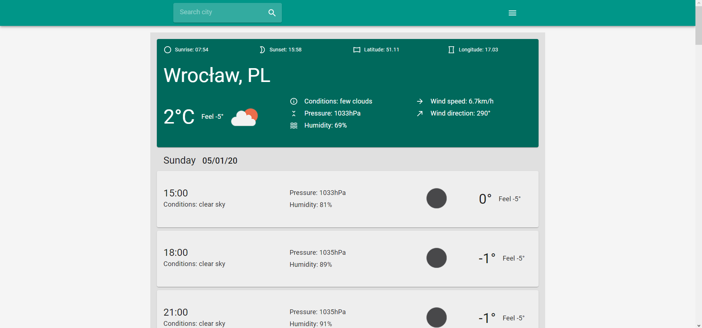
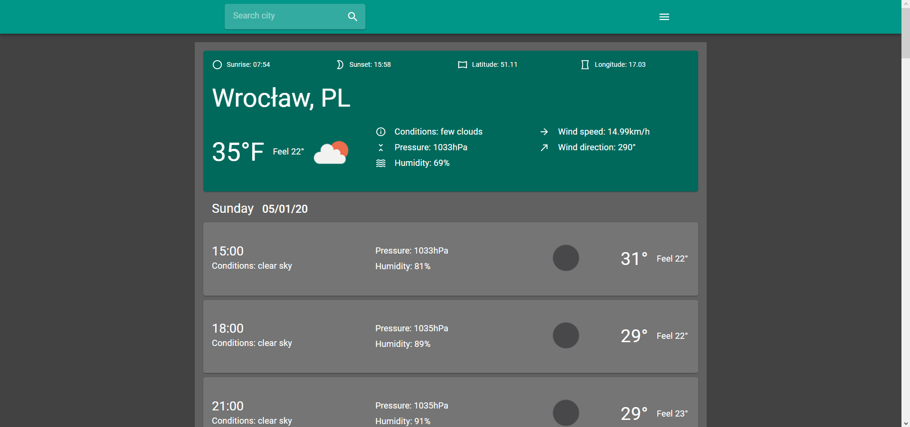
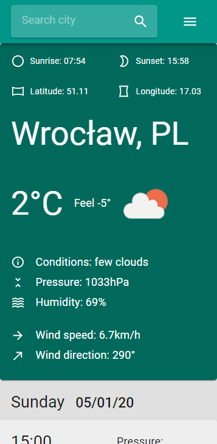
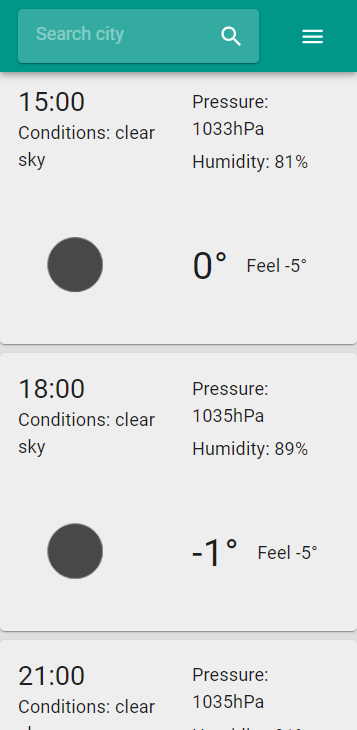

# WatherApp

    A simple responsive single-page weather application created using the Open Weather API.  
    Used technologies: React & Material-UI.

- <a href="https://github.com/facebook/react">React</a>
- <a href="https://github.com/mui-org/material-ui">Material-UI</a>
- <a href="https://openweathermap.org">Open Weather</a>

Install & start
-- 
1. `mkdir <folder_name>`
2. `cd <folder_name>`
3. `git clone https://github.com/Cailette/react-weather-app.git` .
4. `npm install`
5. `npm start` then open [http://localhost:3000](http://localhost:3000) to view it in the browser.
6. If you want connect with [Open Weather API](https://openweathermap.org) you have to create account and get free API key

Functionality
--
1. The first time you open the app, the browser asks you to get your geolocation. If you allow access, the app will show the weather for your location, otherwise for the default location.
2. You can get weather information by entering the city name in the search input in navbar.
3. You can set the application theme dark or light. By default, the theme is "light".
4. You can set the temperature unit to celsius or farenhytes. The default unit is Celsius.
5. The application is responsive and can be displayed on small devices like mobile phones.

    

    

    
    

